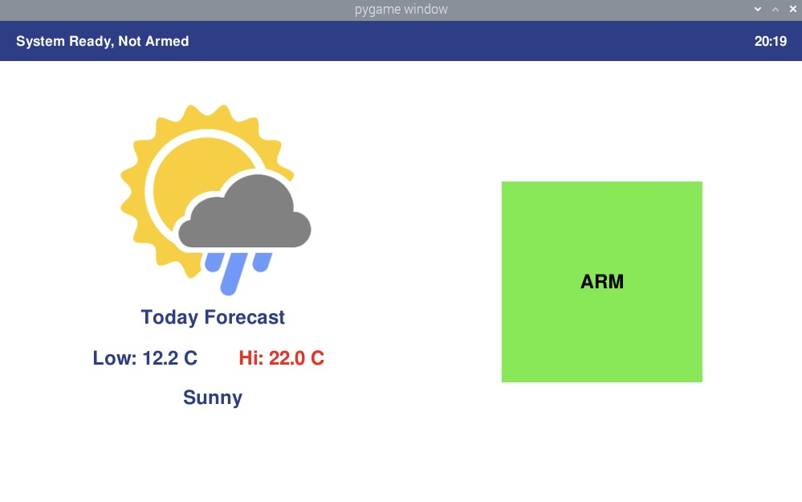
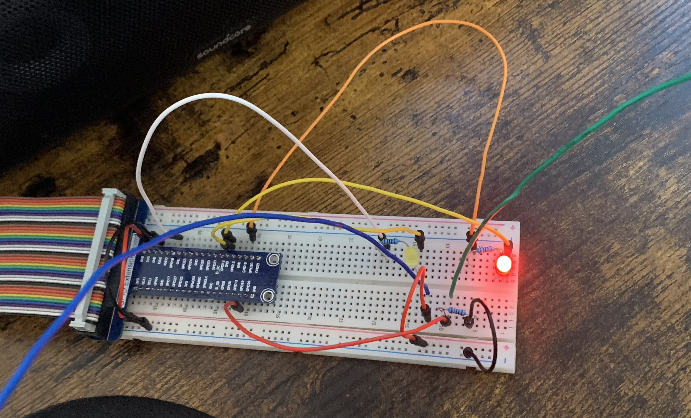
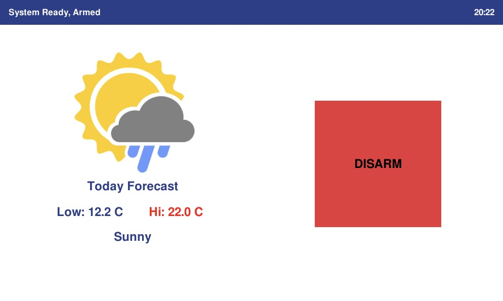

# Alarm-Project

# Introduction

This project was created for my embedded programming class. In this class, we learn how to write embedded programs with a Raspberrypi model 4B with the python programming language.

# Goal

Create a graphical user interface to interact with a basic alarm system.

# How it works

We have a circuit with two LEDs - one red and one yellow - connected to the Raspberrypi GPIOs and a pull down resistor with two wires to simulate the magnetic contact of the door.

When both wires are connected, we read a logical value of 1 at the GPIO pin the pull down resistor is connected to and we read a logical value of 0 when they are disconnected.

Our alarm system is only armed after entering the right code and making sure both wires are connected at the end of the 10 seconds. This delay is for the users to have the time to leave the house before the alarm system is armed. When the system is armed, we have the red LED on and the home owner receives a message text letting them know the system has been successfully armed.

After both wires are disconnected, a 10 seconds delay is started to give the user the time to enter their code and avoid the alarm to be triggered. If the right code is not entered within the 10 seconds following the disconnection of both wires, the alarm is triggered and the home owner receives a message text letting them know the alarm was triggered at home.

# Usage

Update python version to v-3

Install pygame with the command : pip3 install pygame

Install the twilio api with the command : pip3 install twilio

You will need a trial twilio for message texts alerts.

You will also need to generate your url for the weather conditions on this free weather API : https://open-meteo.com

Make sure to use your location to get accurate weather conditions.
